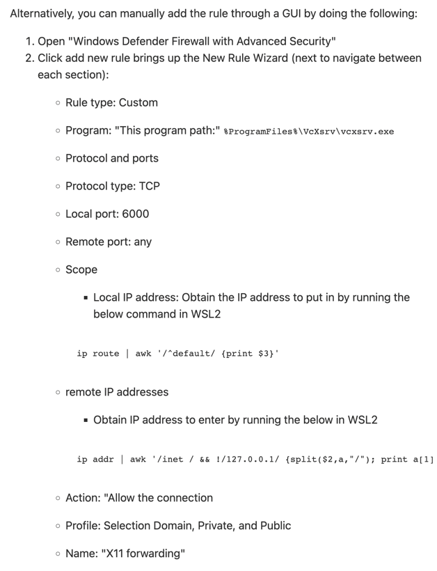

# Squad

An web application dedicated to helping friends manage events and plans to get together. You enter your availability and the application will figure out the best time for everyone to do the thing

## How to setup?

1. Install Node 18
2. Clone this repository
2. Install `npm install -g @cepedaio/cli`
3. `cd` into repo
4. Unpack project `cpa ws unpack`
5. Start project `cpa ws start`

## Rebuild image

Whenever you make changes to files outside of `src` (such as .env or package.json), you must re-build the image and restart the server before they take effect

```bash
cd ./services/api
docker compose build api
cpa ws restart api
```

## Recommendations

### Alias workstation command

You should alias the `ws` command in`.profile` or `.bashrc`
```bash
#In ~/.profile
alias ws='cpa ws'
```

### Work on services locally when slow

Because source files need to be mounted into docker over network and then compiled before being loaded, it can make somethings slow like start up times

If you need to work on something that requires restarting the service a lot, it may be better to work outside of the docker container

```bash
cpa ws stop api
cd ./squad/services/api
yarn dev
```

## Setup GUI display with WSL 2

If you want to run Cypress from your WSL 2 setup, you'll need to be able to run GUI apps originating from WSL

This guide will tell you how to set up your display:
https://medium.com/@japheth.yates/the-complete-wsl2-gui-setup-2582828f4577

You will need to install google chrome on your WSL 2 distro:
https://www.linuxjournal.com/content/how-can-you-install-google-browser-debian

If VcXsrv still doesn't work...

1. Make sure `echo $DISPLAY` correctly returns your IP Address in WSL 2
2. Make sure you have checked "Disable access control" for X-server
3. Ensure that VcXsrv firewalls are enabled:

